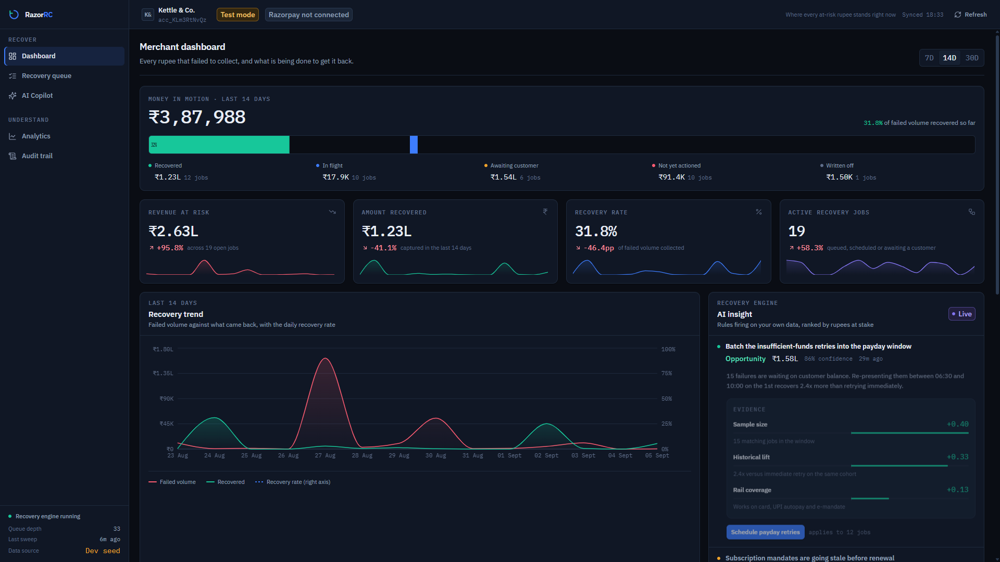
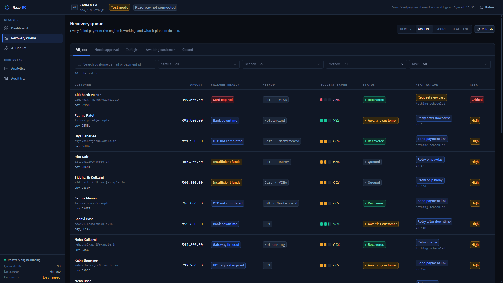
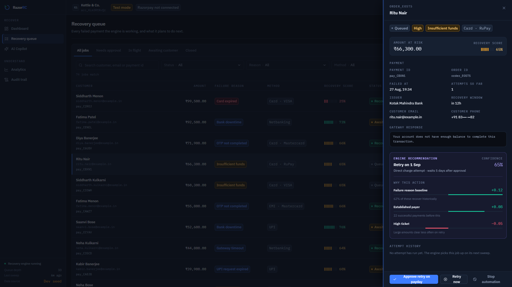

# RazorRC

An AI revenue-recovery console for Razorpay merchants. Failed payments arrive as a worked queue rather than a CSV: a deterministic engine scores each failure, chooses the next action, schedules it, and records every decision in an append-only audit trail.

Built for the Razorpay AI Buildathon 2026, Track 3 — as an internal merchant tool would be built, not as a demo.

## Screenshots

**Merchant Dashboard** — revenue at risk, amount recovered, recovery rate and active jobs, each against the previous period, with the live recovery queue and the insight panel underneath.



**Recovery Queue** — every failed payment as a worked item: score, risk tier, recommended action and SLA, filterable by status, failure reason, method and risk tier.



**AI decision** — the job drawer, showing the signals that produced the score, the action the engine recommends, and the attempt history behind it.



Images live in `docs/screenshots/`. They are captured from the app running against the demo dataset described below, so anything visible in them is reproducible on a fresh install.

## Demo video

**Walkthrough:** _link to be added before submission_ — `https://…`

Running order of the recording: a failed payment landing in the queue, the signal breakdown behind its recovery score, an operator approving the recommended action, and that same action appearing in the audit trail seconds later with the operator's name against it.

## Why RazorRC

Most failure tooling is a report. It tells a merchant that ₹4.2 lakh failed last week, which codes were involved, and roughly which methods are worst — and then leaves the actual recovery work to whoever opens the export. The failures that were never worth chasing sit next to the ones that would have converted on a single retry, and nothing records what anyone decided.

RazorRC is built to be the operator rather than the report. It takes a position on every failure: *this one is worth chasing, by this channel, at this hour, because of these seven signals* — and then it either does it or waits for a human to approve it. That difference shows up in four places.

It **triages instead of aggregating.** A score and a risk tier per payment, so the queue is ordered by expected recovery rather than by timestamp.

It **decides the next action, not just the diagnosis.** Insufficient funds near payday is a scheduled re-presentment; an expired card is a card-refresh nudge; a checkout drop-off is a reminder. The failure taxonomy exists precisely so a new gateway code cannot silently produce a new behaviour.

It **acts on a clock.** Actions are scheduled with delays, and a sweep thread starts what is due. Recovery windows are short, and a recommendation nobody executed is worth nothing.

It **is accountable.** Every score, approval, suppression, retry and automated action lands in an append-only trail, attributed and timestamped. A merchant can audit the engine's reasoning and overrule it — which is the point. An operator that cannot be questioned is not one you would let near live revenue.

The judgement itself is deliberately deterministic rather than generative. Revenue decisions have to be explainable to a finance team, reproducible in a test, and stable across runs, so the engine reasons in weighted signals and shows its work; the language model sits above it in the Copilot, answering questions about the data, never quietly deciding who gets charged again.

## What it does

A payment fails. Razorpay tells you the code and the amount, and that is where most dashboards stop. RazorRC takes it three steps further: it decides whether this failure is worth chasing, decides *how* to chase it, and remembers who decided what.

The recovery score is a rules engine, not a model — seven weighted signals over the payment, the customer's history and the failure taxonomy, each contributing a nudge in one direction or the other. Every recommendation carries the signals that produced it, so a merchant can disagree with the reasoning rather than with a number. The same determinism is what makes the engine testable: given a payment, the score and the recommended action are always the same, and the test suite asserts on them directly.

Five surfaces:

**Dashboard** — revenue at risk, amount recovered, recovery rate and active jobs, each with a period-over-period delta; the live recovery queue; an insight panel; and a recovery timeline.

**Recovery Queue** — filterable by status, failure reason, method and risk tier, with a drawer per job showing the signal breakdown, the attempt history, and the three actions an operator can take (approve the recommendation, retry now, suppress with a reason).

**AI Copilot** — a query surface over the merchant's own recovery data. There is deliberately no scripted chat: with no model provider configured the composer renders a "not connected" state instead of faking an answer.

**Analytics** — trend, failure mix, method mix, and attempt effectiveness, all windowed.

**Audit Trail** — every state transition, every operator action, every sweep that did something, searchable and filterable by severity.

## AI Recovery Workflow

```
        Payment Failed
              ↓
    Failure Classification
              ↓
    Recovery Score Engine
              ↓
 AI Recovery Recommendation
              ↓
Merchant Approval / Automation
              ↓
       Recovery Action
              ↓
   Audit Trail + Metrics
```

**Payment Failed** — a failure enters the store as a `failed_payment` row plus a `recovery_job`, carrying the amount in paise, the method, the network, the issuer and the gateway's own description. In Phase 1 this is the demo ingest; in Phase 2 it is the `payment.failed` webhook.

**Failure Classification** — the gateway code is mapped onto a fixed ten-value taxonomy (`domain.rs`) at ingest. The rules engine never reasons about gateway vocabulary, so a new Razorpay code cannot invent a new behaviour without someone extending the taxonomy on purpose.

**Recovery Score Engine** — `recovery/rules.rs` applies seven weighted signals: the historical recovery rate for that failure reason, the customer's successful-payment history (or absence of one), retry fatigue, ticket size, whether a mandate is on file, and whether the rail is UPI. Output is a 0–100 score, a risk tier, and the `Signal[]` that produced them.

**AI Recovery Recommendation** — the same pass chooses an action kind and channel with a delay attached — re-present the mandate, retry now, refresh the card, send a reminder, or write it off — and the recommendation travels with its evidence, so the drawer can show *why* rather than just *what*.

**Merchant Approval / Automation** — an operator can approve, retry immediately, or suppress with a reason; a matching enabled playbook can schedule the action without asking. Both paths converge on the same command layer, so an automated action and a human one are recorded identically.

**Recovery Action** — the sweep thread wakes each minute, claims the jobs whose scheduled moment has arrived, and writes a `recovery_attempt`. Claiming is transactional: if an operator closed the job since the query, the human wins and the sweep skips it.

**Audit Trail + Metrics** — the attempt and its audit event commit in one transaction, then the dashboard, analytics and playbook statistics recompute from the same rows. Nothing in the product is a counter maintained by hand.

## Running it

### Prerequisites

Node.js 20 or newer, a package manager (pnpm 9 is what the Linux build was validated with; npm works identically), and a stable Rust toolchain via [rustup](https://rustup.rs). Tauri also needs a few system libraries, listed per platform below. `pnpm install` and `npm install` are interchangeable throughout — the scripts are the same.

### From source

```bash
npm install
npm run app:dev      # Tauri shell + Vite dev server
```

Or, with pnpm:

```bash
pnpm install
pnpm app:dev
```

The webview alone also runs, against the seeded browser dataset, which is useful for UI work:

```bash
npm run dev
```

To produce an installer:

```bash
npm run app:build    # runs `npm run build` first, then bundles
```

Copy `.env.example` to `.env` before the first run if you want to override the merchant identity, the operator name recorded in the audit trail, or the database location. Every value has a working default, and a missing `.env` is normal — the app starts without Razorpay credentials and says so in the sidebar rather than refusing to launch.

Useful scripts: `npm run typecheck` (`tsc --noEmit`), `npm run lint`, and on the Rust side `cargo test --manifest-path src-tauri/Cargo.toml`, which exercises the engine, the store and the migrations without a webview.

### Download a build (GitHub Releases)

_Placeholder — the installer will be attached to the first tagged release:_ `https://github.com/<owner>/RazorRC/releases`

| Platform | Artifact |
| --- | --- |
| Windows 10/11 (x64) | `RazorRC_1.0.0_x64-setup.exe` — NSIS installer |
| macOS, Linux | No native build — these platforms use the web version |

The desktop app ships for Windows only, so there is no `.dmg`, AppImage or `.deb` to download. Nothing in the code is Windows-specific — the app still compiles and runs on Linux and macOS, which is where most of the development happens — but those platforms are served by the web build rather than an installer. The filename above is derived from `productName` and `version`, so it tracks those two fields rather than being spelled out anywhere, and the installer lands in `src-tauri\target\release\bundle\nsis\`.

### Windows

Install the [Microsoft C++ Build Tools](https://visualstudio.microsoft.com/visual-cpp-build-tools/) with the "Desktop development with C++" workload, and [WebView2 Runtime](https://developer.microsoft.com/microsoft-edge/webview2/) — already present on Windows 11 and on updated Windows 10. Then:

```powershell
rustup default stable-msvc
pnpm install
pnpm app:build          # -> src-tauri\target\release\bundle\nsis\*-setup.exe
```

The build produces an **NSIS installer** (`.exe`) that installs per-user, so no administrator prompt appears, and WebView2 is fetched by the installer if the machine does not already have it. The installer is unsigned, so SmartScreen will warn on first run; "More info → Run anyway" clears it. Code signing is a release-time step, not a build one. The database is created under `%APPDATA%\com.razorrc.desktop\`.

### Developing on Linux or macOS

Neither platform produces an installer, but both run the app from source. On Debian or Ubuntu, Tauri v2 needs WebKitGTK 4.1 and a tray/appindicator library:

```bash
sudo apt install libwebkit2gtk-4.1-dev build-essential curl wget file \
  libxdo-dev libssl-dev libayatana-appindicator3-dev librsvg2-dev
pnpm install
pnpm app:dev
```

Fedora uses `webkit2gtk4.1-devel`, `openssl-devel`, `libappindicator-gtk3-devel` and `librsvg2-devel`; Arch uses `webkit2gtk-4.1`, `libappindicator-gtk3` and `librsvg`; macOS needs only the Xcode Command Line Tools (`xcode-select --install`). For a release binary without any bundling, `pnpm tauri build --no-bundle`. The database lives under `~/.local/share/com.razorrc.desktop/` or `~/Library/Application Support/com.razorrc.desktop/`, or wherever `RAZORRC_DB_PATH` points.

### Bundle configuration

Release settings live in one file. `src-tauri/tauri.conf.json` carries the product metadata — `productName` `RazorRC`, `identifier` `com.razorrc.desktop`, `version` `1.0.0` — the window, the CSP, the icon set, the single `nsis` bundle target, and the Windows-specific settings under `bundle.windows`: per-user install mode and the WebView2 download bootstrapper. There are deliberately no per-platform config overlays, because an overlay's `targets` array replaces the base one and would quietly reintroduce a bundle for a platform that is no longer shipped.

The icon set comes from one 1024px master: `32x32.png`, `128x128.png` and `128x128@2x.png` for the window, and `icon.ico` (16 through 256) for Windows and the NSIS installer. `icon.icns` is kept for the macOS window icon during development. All PNGs are 32-bit RGBA, which Tauri requires and rejects builds without.

Every bundle key is validated against the config schema that ships with the pinned CLI (`@tauri-apps/cli` 2.11.4, JSON Schema draft-07, `additionalProperties: false`), so a misspelled bundle key cannot reach a build.

`.github/workflows/release.yml` builds the installer on `windows-latest` and attaches it to a draft GitHub Release when a `v*` tag is pushed. It never creates a tag: `tagName` is passed only when the ref already is one, and a manual `workflow_dispatch` run uploads the installer as a workflow artifact instead of touching releases at all.

Note for anyone upgrading a local install: the `identifier` determines the application-data directory, so changing it moves the database. A database written under an earlier identifier is not migrated; point `RAZORRC_DB_PATH` at the old file if you want to keep it.

## Built With

**React 18** and **TypeScript** — the console is a lot of stateful tables, drawers and filters, and strict TypeScript is what keeps the paise-versus-rupees and status-taxonomy mistakes from reaching the screen. Every Rust struct that crosses the bridge has a matching interface in `src/domain/types.ts`.

**Tauri v2** — a desktop shell with a per-command permission model. The webview is granted `core:default` and nothing else, so the frontend cannot touch the filesystem, spawn a shell or make an HTTP request; the only way to the database is through the sixteen audited commands. That is a security property Electron would not have given for free.

**Rust** — the recovery engine, the scoring rules, the sweep thread and the store. Determinism and an append-only trail are the product claims, and both are easier to guarantee in a typed language with real transactions and a test suite that runs without a UI.

**SQLite** (rusqlite, bundled) — local, transactional and inspectable. `STRICT` tables, WAL journaling, foreign keys on, and triggers that make `audit_events` reject updates and deletes outright.

**Tailwind CSS** — a small set of semantic tokens (`canvas`, `surface`, `raised`, `hairline`, `content`, `azure`, `mint`, `amber`, `coral`) rather than ad-hoc hex values, which is what keeps the dark fintech theme coherent across five pages.

**Recharts** — the trend, mix and effectiveness charts, themed against the same tokens so the visualisations do not look bolted on.

**Vite** — dev server and bundler, with the Tauri dev URL wired to port 1420.

## Architecture

The React app never talks to SQLite. It talks to a `DataSource` — six repository interfaces defined in `src/data/repositories.ts` — and `src/data/index.ts` picks the implementation once, at module load: the Tauri adapter when running inside the desktop shell, the seed adapter otherwise. Set `VITE_FORCE_SEED=1` to keep the seeded data while running the shell. Every page is written against the interface, so no component knows or cares which side of the bridge its data came from.

On the Rust side, `AppState` exposes exactly two ways to reach the database, `read` and `write`. A write opens a transaction, and the change and its audit event commit together or not at all. There is no third path, which is what makes "every action is in the trail" a property of the code rather than a promise in this README. The webview cannot bypass it either: `capabilities/default.json` grants only `core:default`, so there is no filesystem, shell or HTTP access in the frontend at all.

```
src/
  app/            router and route metadata
  components/     ui primitives, domain components, charts, layout
  data/           repositories, seed adapter, tauri adapter, fixtures
  domain/         shared types, formatting, taxonomy labels
  features/       one folder per page
  hooks/          useQuery / useAction against the DataSource
src-tauri/src/
  domain.rs       the shared model, mirrored field-for-field in TypeScript
  db/             store, migrations, jobs, audit, metrics, playbooks
  recovery/       rules (scoring), engine (sweep thread), insights
  state.rs        read / write — the only two doors to the database
  commands.rs     the sixteen commands the adapter calls
  bootstrap.rs    default playbooks and the demo dataset
```

Money is stored and moved as integer paise; there is no float anywhere in the money path. Timestamps are fixed-width ISO-8601 UTC millisecond strings, so a `TEXT` column sorts chronologically and SQLite can do the ordering. Schema tables are `STRICT`, `audit_events` is append-only by trigger — an `UPDATE` or `DELETE` against it raises `audit_events is append-only` — and the engine writes nothing on a sweep that finds nothing, because sixty empty events an hour would bury the merchant's own actions.

## The demo dataset

On first run against an empty store the engine ingests twelve failed payments and closes four of them as recovered. Every row goes through the real `jobs::ingest` path, so the scores, risk tiers, recommended actions and signals on screen are the engine's own output rather than fixtures — and the seeding announces itself in the audit trail as `system.demo_seed`. Set `RAZORRC_DEMO_SEED=0` to start empty.

## Verification status

The app has been built and run on **Linux** with Node.js, pnpm, Rust and Tauri: the frontend typechecks and bundles, the Rust crate compiles, `cargo test` passes over the engine, the store and the migrations, and the desktop shell starts against a real SQLite database with the demo dataset seeded through the live ingest path.

**The Windows installer will be validated before release.** Nothing in the code is platform-specific — the store resolves its own path from the OS application-data directory, and the only Windows-only line is the release-mode `windows_subsystem` attribute in `main.rs` — but the NSIS bundle has not been produced yet, so treat the installer name in the Releases table above as intended rather than tested. `.github/workflows/release.yml` on `windows-latest` is what will confirm it.

Alongside the build, the project is held together by scripted consistency checks worth knowing about: the sixteen `generate_handler!` names match the adapter's command list exactly; every `module::item` call resolves to a declared public item; every table and column named in SQL exists in the schema; and the serde field names on every Rust struct match the TypeScript interface it crosses the bridge as. Those four invariants are the ones that break silently when the two halves of the app drift apart, which is why they are checked rather than assumed.

## Phase 2

Razorpay Test Mode ingestion (a `payment.failed` webhook with HMAC verification, plus a backfill over the Payments API), real action delivery for the retry and reminder channels, and a model provider behind the Copilot. The credential names those need are already in `.env.example`, and the transport boundary is the only thing that has to change: the rules engine, the store and the audit trail are already the shape they need to be.
