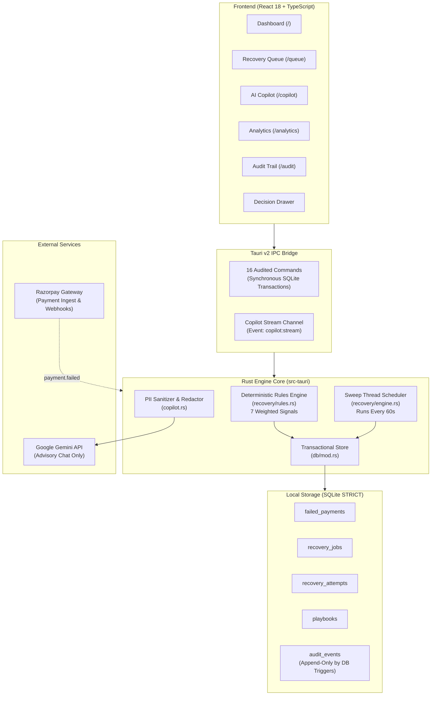

# RazorRC

> **Autonomous AI Revenue Recovery Console for Razorpay Merchants**  
> *Transform cold, unworked payment failure CSVs into a prioritized, deterministic recovery queue backed by bounded playbooks and an immutable audit trail.*

[](https://github.com/mrfrosty7007/RazorRC)
[](https://tauri.app)
[](https://www.rust-lang.org)
[](https://react.dev)
[](https://sqlite.org)
[](LICENSE)

---


---

## Table of Contents

- [Overview](#overview)
  - [The Problem: Why CSV-Based Recovery Fails](#the-problem-why-csv-based-recovery-fails)
  - [The RazorRC Solution](#the-razorrc-solution)
  - [Deterministic Decision Engine vs. Generative AI](#deterministic-decision-engine-vs-generative-ai)
- [Key Features](#key-features)
- [Screenshots](#screenshots)
  - [1. Merchant Dashboard & Money in Motion](#1-merchant-dashboard--money-in-motion)
  - [2. Prioritized Recovery Queue](#2-prioritized-recovery-queue)
  - [3. Deterministic Decision Drawer](#3-deterministic-decision-drawer)
- [Demo Video & Walkthrough](#demo-video--walkthrough)
- [Quick Start](#quick-start)
  - [Option A: Instant Web Preview](#option-a-instant-web-preview)
  - [Option B: Native Desktop Application](#option-b-native-desktop-application)
  - [Option C: Build Standalone Windows Installer](#option-c-build-standalone-windows-installer)
- [Installation Guide](#installation-guide)
  - [Prerequisites](#prerequisites)
  - [Windows Setup](#windows-setup)
  - [Linux Setup](#linux-setup)
  - [macOS Setup](#macos-setup)
  - [Environment Configuration (.env)](#environment-configuration-env)
- [Running RazorRC (Feature Walkthrough)](#running-razorrc-feature-walkthrough)
  - [1. Merchant Dashboard (`/`)](#1-merchant-dashboard-)
  - [2. Recovery Queue (`/queue`)](#2-recovery-queue-queue)
  - [3. Decision Drawer & Operator Actions](#3-decision-drawer--operator-actions)
  - [4. AI Copilot & Automation Playbooks (`/copilot`)](#4-ai-copilot--automation-playbooks-copilot)
  - [5. Analytics & Retry Economics (`/analytics`)](#5-analytics--retry-economics-analytics)
  - [6. Immutable Audit Trail (`/audit`)](#6-immutable-audit-trail-audit)
- [Troubleshooting](#troubleshooting)
- [Architecture](#architecture)
  - [System Flow Diagram](#system-flow-diagram)
  - [Component Responsibilities](#component-responsibilities)
  - [Financial Integrity & Security Model](#financial-integrity--security-model)
- [Tech Stack](#tech-stack)
- [Demo Dataset](#demo-dataset)
  - [The Hero Case: Ritu Nair](#the-hero-case-ritu-nair)
  - [Resetting Demo Data](#resetting-demo-data)
- [Project Structure](#project-structure)
- [Testing & Verification](#testing--verification)
- [Releases](#releases)
- [Roadmap](#roadmap)
  - [Current MVP (Track 03 Submission)](#current-mvp-track-03-submission)
  - [Phase 2: Live Gateway Integration](#phase-2-live-gateway-integration)
  - [Phase 3: Multi-Merchant & Omnichannel Delivery](#phase-3-multi-merchant--omnichannel-delivery)

---

## Overview

### The Problem: Why CSV-Based Recovery Fails

For Indian internet businesses using modern payment gateways like Razorpay, payment failures represent a silent 3% to 7% leak on top-line revenue. Today, merchant failure tooling is strictly passive:

1. **Failure Reports Without Triage:** Gateways export bulk CSVs days after transactions fail, commingling permanent write-offs (e.g. invalid cards) with high-probability recoveries (e.g. salary-day insufficient funds).
2. **Blind Immediate Retries:** Blind automated retry scripts trigger immediate card re-presentments, which fail repeatedly, degrade issuer reputation, trigger card network penalties, and exhaust customer patience.
3. **No Operator Accountability:** When a recovery action is taken, no unalterable audit log records who authorized the charge, what rationale justified it, or which playbook step ran.

### The RazorRC Solution

**RazorRC** is an autonomous, deterministic AI revenue recovery console built specifically for Razorpay merchants. Rather than acting as a reporting tool, RazorRC acts as an **autonomous financial operator**:

- **Real-Time Triage:** Every failure is mapped onto a strict 10-reason failure taxonomy and scored (0–100) using a 7-signal deterministic rules engine.
- **Clock-Driven Scheduling:** Recommendations carry precise execution delays (e.g. scheduling an insufficient-funds retry for 06:30 UTC on salary day, or waiting 90 minutes for an issuer bank downtime to clear).
- **Bounded Automation:** Merchants define explicit guardrails via automated Playbooks (e.g. routing transactions above ₹50,000 to manual human review).
- **Immutable Audit Trail:** Enforced at the database engine level via SQLite triggers, guaranteeing that every decision, operator approval, and automated sweep is permanently recorded and exportable.

### Deterministic Decision Engine vs. Generative AI

In fintech, charging a customer's payment instrument must be **explainable to finance teams, mathematically reproducible in test suites, and compliant with PCI-DSS guidelines**. 

```
┌─────────────────────────────────────────────────────────────┐
│                       RazorRC Engine                        │
│                                                             │
│   Deterministic Core (Rust)     Advisory Copilot (Gemini)   │
│   ┌────────────────────────┐    ┌────────────────────────┐  │
│   │ • 7-Signal Scoring     │    │ • Pattern Analysis     │  │
│   │ • Action Scheduling    │    │ • Merchant Q&A         │  │
│   │ • Playbook Execution   │    │ • PII-Sanitized Context│  │
│   │ • Audit Ledger Writes  │    │ • Zero Direct Debits   │  │
│   └────────────────────────┘    └────────────────────────┘  │
└─────────────────────────────────────────────────────────────┘
```

- **The Rules Engine Executes:** Written in Rust, the rules engine applies empirical weights across customer lifetime value, payment history, rail speed, and failure reasons. It never hallucinates.
- **The LLM Advises:** Google Gemini (`gemini-3.7-flash`) powers the Copilot composer, answering merchant questions about failure patterns and cohort economics. Client-side PII sanitization strips customer emails, phone numbers, and payment IDs before prompt dispatch.

[↑ Back to Top](#table-of-contents)

---

## Key Features

- **Revenue at Risk Dashboard:** Features a continuous 5-stage *Money in Motion* band (`Recovered`, `In flight`, `Awaiting customer`, `Not yet actioned`, `Written off`), synchronized with 4 windowed KPI cards across 7D, 14D, and 30D calendar windows.
- **Prioritized Recovery Queue:** Organizes failures into high-yield working queues filterable by status, payment rail, failure taxonomy, and risk tier.
- **7-Signal Deterministic Recovery Score:** Every transaction receives a 0–100 score with an itemized signal breakdown explaining the exact baseline, customer history, retry fatigue, and ticket size weights.
- **Actionable Decision Drawer:** Allows operators to review raw gateway logs, customer lifetime value, recovery SLA countdowns, and execute one-click approvals, immediate manual retries, or suppressions.
- **Automated Merchant Playbooks:** Pre-configured rule sets (`Payday re-present`, `Issuer downtime hold`, `Card refresh`, `Checkout drop-off rescue`, `High-value manual desk`) that automate multi-step retry chains with mandatory cooldowns.
- **Retry Economics & Fatigue Analysis:** Evaluates marginal recovery yield across attempt rungs (Sequence 1 to 4+) against an **8% decision floor** to prevent unprofitable retries and gateway penalty fees.
- **Gemini Advisory Copilot:** Natural language recovery copilot with persistent SQLite conversation sessions and client-side PII redaction.
- **Trigger-Enforced Audit Trail:** SQLite triggers reject any `UPDATE` or `DELETE` on the audit table, providing an unalterable compliance ledger with RFC-compliant CSV export.

[↑ Back to Top](#table-of-contents)

---

## Screenshots

### 1. Merchant Dashboard & Money in Motion

- **What You See:** The continuous *Money in Motion* allocation band (₹3,87,988 failed volume), four KPI cards with period-over-period trend sparklines, the dual-axis recovery trend chart, and proactive AI insight alerts.
- **Why It Matters:** Gives finance teams instant visibility into how much failed revenue is actively recovering versus unworked, updating synchronously when changing window ranges.

---

### 2. Prioritized Recovery Queue

- **What You See:** Failed payments structured into a prioritized queue sorted by financial exposure. Tabs filter by lifecycle state (`Needs approval`, `In flight`, `Awaiting customer`, `Closed`).
- **Why It Matters:** Operators focus on high-ticket, high-probability recoveries (e.g. ₹92,500 downtime or ₹66,300 insufficient funds) rather than triaging flat chronological exports.

---

### 3. Deterministic Decision Drawer

- **What You See:** The decision drawer for Ritu Nair (₹66,300). Displays raw gateway error text, customer LTV (₹1.67L, 22 prior payments), recommended payday re-presentment, and the **7-signal score evidence** (+0.12 baseline, +0.08 established payer, -0.05 high ticket).
- **Why It Matters:** Demonstrates full explainability. Operators and finance teams see the exact mathematical justification behind every recommendation before approving it.

[↑ Back to Top](#table-of-contents)

---

## Demo Video & Walkthrough

| Resource | Link | Description |
| :--- | :--- | :--- |
| **Walkthrough Video** | [](https://github.com/mrfrosty7007/RazorRC) | Complete 5-minute narrated walkthrough of all five surfaces. |
| **Submission Pitch Package** | [docs/SUBMISSION_PITCH_PACKAGE.md](docs/SUBMISSION_PITCH_PACKAGE.md) | Second-by-second storyboard (00:00–05:00), script, and camera choreography. |

### Where Judges Should Look First
1. **Start on the Dashboard (`/`):** Toggle between **14D** and **30D** in the top-right corner to verify dynamic window calculations.
2. **Open the Recovery Queue (`/queue`):** Click the **Needs approval** tab and sort by **AMOUNT**.
3. **Inspect Ritu Nair (`job_CBXN1`):** Click her row to open the decision drawer, inspect the weighted signals, and click **Approve retry on payday**.
4. **Verify the Audit Trail (`/audit`):** Navigate to the Audit Trail to confirm that the approval committed immediately with operator attribution (`Priya Menon`).

[↑ Back to Top](#table-of-contents)

---

## Quick Start

### Option A: Instant Web Preview
Runs the frontend web application in your browser against the local deterministic seed engine:

```bash
git clone https://github.com/mrfrosty7007/RazorRC.git
cd RazorRC
pnpm install
pnpm dev
```
> [!TIP]
> The app is immediately available at **`http://localhost:1420/`**.

---

### Option B: Native Desktop Application
Runs the desktop app inside the native Tauri v2 shell backed by the Rust engine and local SQLite:

```bash
# Ensure MSVC toolchain is selected (Windows)
rustup default stable-msvc

# Launch Tauri development environment
pnpm app:dev
```

---

### Option C: Build Standalone Windows Installer
Compiles the production-optimized Windows NSIS installer (`.exe`):

```bash
pnpm app:build
```
> [!NOTE]
> The binary lands in `src-tauri/target/release/bundle/nsis/RazorRC_1.0.0_x64-setup.exe`.

[↑ Back to Top](#table-of-contents)

---

## Installation Guide

### Prerequisites

| Tool | Minimum Version | Verification Command |
| :--- | :--- | :--- |
| **Node.js** | 20.x or newer (tested on 24.x) | `node -v` |
| **pnpm** | 9.x or newer (tested on 11.x) | `pnpm -v` |
| **Rust** | 1.77 or newer (tested on 1.98.0) | `cargo --version` |
| **C++ Build Tools** | Visual Studio 2022 Build Tools (Windows) | Included with MSVC workload |
| **WebView2** | Evergreen Runtime (Pre-installed on Win 10/11) | Standard system component |

---

### Windows Setup

1. **Install Build Tools & Rust:**
   Install the [Microsoft C++ Build Tools](https://visualstudio.microsoft.com/visual-cpp-build-tools/) with the *"Desktop development with C++"* workload. Then install Rust via [rustup.rs](https://rustup.rs):
   ```powershell
   rustup default stable-msvc
   ```

2. **Clone & Install Dependencies:**
   ```powershell
   git clone https://github.com/mrfrosty7007/RazorRC.git
   cd RazorRC
   pnpm install
   ```

3. **Launch Desktop App:**
   ```powershell
   pnpm app:dev
   ```

---

### Linux Setup

On Debian/Ubuntu-based distributions, install required system development packages:

```bash
sudo apt update && sudo apt install -y \
  libwebkit2gtk-4.1-dev \
  build-essential \
  curl \
  wget \
  file \
  libxdo-dev \
  libssl-dev \
  libayatana-appindicator3-dev \
  librsvg2-dev

git clone https://github.com/mrfrosty7007/RazorRC.git
cd RazorRC
pnpm install
pnpm app:dev
```

---

### macOS Setup

Install Xcode Command Line Tools:

```bash
xcode-select --install
git clone https://github.com/mrfrosty7007/RazorRC.git
cd RazorRC
pnpm install
pnpm app:dev
```

---

### Environment Configuration (.env)

RazorRC works out of the box with zero configuration using working defaults. To connect Google Gemini or customize the merchant profile:

```bash
cp .env.example .env
```

```ini
# Gemini Copilot (Optional: enables natural language analytical chat)
COPILOT_API_KEY=your_gemini_api_key_here
COPILOT_MODEL=gemini-3.7-flash

# Merchant Profile Customization
RAZORRC_MERCHANT_NAME="Kettle & Co."
RAZORRC_MERCHANT_ID="acc_KLm3RtNvQz"

# Razorpay Test Mode Credentials (Optional Phase 2 Webhooks)
RAZORPAY_KEY_ID=rzp_test_...
RAZORPAY_KEY_SECRET=...
RAZORPAY_WEBHOOK_SECRET=...
```

[↑ Back to Top](#table-of-contents)

---

## Running RazorRC (Feature Walkthrough)

### 1. Merchant Dashboard (`/`)
- **Action:** Open the dashboard and observe the **Money in Motion** band.
- **Interaction:** Click **7D**, **14D**, and **30D** in the top right. Watch the 4 KPI cards (`Revenue at risk`, `Amount recovered`, `Recovery rate`, `Active recovery jobs`) and the dual-axis chart re-render synchronously.
- **AI Insights:** Check the right-hand panel for automated pattern alerts like *Batch insufficient-funds retries into the payday window* (+₹1.58L opportunity).

### 2. Recovery Queue (`/queue`)
- **Action:** Click **Recovery queue** in the sidebar.
- **Interaction:** Click the preset tabs: `All jobs`, `Needs approval`, `In flight`, `Awaiting customer`, `Closed`.
- **Search & Sort:** Type a customer name (e.g., `Ritu`) into the search bar, or click **AMOUNT** to sort by rupees at stake.

### 3. Decision Drawer & Operator Actions
- **Action:** Click any job row (e.g. `Ritu Nair — ₹66,300.00`).
- **Review Evidence:** Read the customer's payment history, gateway error text, and the **Why this action** signal breakdown.
- **Execute Decision:**
  - Click **Approve retry on payday**: The job immediately moves to `Scheduled` state with an assigned execution timestamp.
  - Click **Retry now**: Manually queues an immediate gateway attempt.
  - Click **Stop automation**: Halts automated retries and requires a suppression reason.

### 4. AI Copilot & Automation Playbooks (`/copilot`)
- **Recommendation Queue:** Review batch recommendations clustered by action type (e.g., *Retry on payday*, *Offer UPI*, *Request new card*).
- **Automation Playbooks:** View the 5 pre-configured rule sets. Toggle a playbook (e.g. `Issuer downtime hold`) on or off; observe the state update in real time.
- **Gemini Copilot:** Type a question (e.g. *"Which failure reason lost us the most money this week?"*) or click a starter prompt pill. Messages stream in real time and persist across sessions.

### 5. Analytics & Retry Economics (`/analytics`)
- **Where the Money Leaks:** Inspect failure reasons sorted by value at risk and historical recovery rate.
- **Rail Effectiveness:** Compare recovery conversion across Cards, UPI, Netbanking, e-Mandates, and Wallets.
- **Attempt Effectiveness Table:** Review the marginal yield per attempt rung (Sequence 1 to 4+). Observe the **8% decision floor** where further retries cost more in fees than they collect.

### 6. Immutable Audit Trail (`/audit`)
- **Audit Verification:** Inspect the chronological log of all operator approvals, system sweeps, and playbook modifications.
- **Filtering:** Filter by severity (`Critical`, `Warning`, `Notice`, `Info`) or search by payment ID.
- **Export View:** Click **Export view** to download `razorrc-audit-YYYY-MM-DD.csv`, verified with RFC CRLF endings and spreadsheet formula injection sanitization.

[↑ Back to Top](#table-of-contents)

---

## Troubleshooting

| Problem | Root Cause | Verified Resolution |
| :--- | :--- | :--- |
| **`cargo: command not found`** | Rust is not installed or not in system `PATH`. | Install via `winget install Rustlang.Rustup` or from [rustup.rs](https://rustup.rs). Restart your terminal. |
| **`LINK : fatal error LNK1181: cannot open input file 'msvcrt.lib'`** | Missing Microsoft C++ Build Tools or Windows SDK. | Run `winget install Microsoft.VisualStudio.2022.BuildTools --override "--passive --add Microsoft.VisualStudio.Workload.VCTools --includeRecommended"`. |
| **`WebView2Loader.dll not found` or blank window** | Missing Microsoft Edge WebView2 runtime. | Download and run the official [WebView2 Evergreen Bootstrapper](https://go.microsoft.com/fwlink/p/?LinkId=2124703). |
| **`pnpm: command not found`** | pnpm package manager is not installed globally. | Run `npm install -g pnpm` or `corepack enable pnpm`. |
| **Port 1420 is in use (`EADDRINUSE`)** | An existing Vite or Tauri dev server is already running. | In PowerShell: `Get-Process node \| Stop-Process -Force`. Alternatively, use `Stop-Process -Id (Get-NetTCPConnection -LocalPort 1420).OwningProcess`. |
| **Tauri fails to build with esbuild permission error** | pnpm 10+ requires explicit build scripts permission. | `pnpm-workspace.yaml` already includes `allowBuilds: esbuild: true`. Run `pnpm install` again. |
| **Stale demo data or 30D filter matches 14D** | Database was seeded under an earlier release schema. | Delete the local SQLite database file: `Remove-Item "$env:APPDATA\com.razorrc.desktop\recovery.sqlite3" -Force` and relaunch `pnpm app:dev`. |
| **Windows SmartScreen warning on installer** | The NSIS installer executable is unsigned. | Click **More info** &rarr; **Run anyway** to bypass local SmartScreen. |
| **Copilot shows "Not connected"** | `COPILOT_API_KEY` is missing or empty in `.env`. | Add your Gemini API key to `.env` as `COPILOT_API_KEY=AIzaSy...` and restart the application. |
| **Audit CSV export fails or opens empty** | Webview file download permission restriction. | RazorRC creates an explicit DOM anchor, injects CRLF, and delays blob revocation. Use the **Export view** button on `/audit`. |

[↑ Back to Top](#table-of-contents)

---

## Architecture

### System Flow Diagram



### Component Responsibilities

1. **Frontend (`src/`):** Built with React 18, Tailwind CSS, and Recharts. All data access routes through the [`DataSource`](src/data/repositories.ts) interface, switching dynamically between the Tauri IPC adapter and seed adapter.
2. **IPC Command Layer (`src-tauri/src/commands.rs`):** Strictly typed IPC bridge exposing 16 audited commands. Errors cross as human-readable strings; operator identity is sourced from the process environment.
3. **Scoring Engine (`src-tauri/src/recovery/rules.rs`):** Applies 7 weighted signals to produce a normalized 0–100 recovery score and next action with an attached cooldown delay.
4. **Scheduler Sweep Thread (`src-tauri/src/recovery/engine.rs`):** Wakes once every minute, claims jobs whose scheduled moment has arrived, and commits attempt records transactionally.
5. **Database Ledger (`src-tauri/src/db/`):** Bundled SQLite operating in WAL mode with `STRICT` tables. All monetary values are stored as integer paise (no floats). Database triggers enforce append-only immutability on `audit_events`.

### Financial Integrity & Security Model

> [!IMPORTANT]
> **Strict Paise Accounting:** RazorRC never uses floating-point types for monetary values. All amounts are stored, calculated, and communicated as 64-bit integer paise (e.g. ₹1,234.50 is stored as `123450`).

- **Capability Sandboxing:** The Tauri webview is granted `core:default` permissions only. It has zero access to the filesystem, shell execution, or arbitrary external HTTP networks.
- **PII Redaction:** Free-form prompts to the Gemini Copilot are processed by `redact_prompt`, replacing email addresses, telephone numbers, card numbers, and bank account tokens with `[REDACTED]`.

[↑ Back to Top](#table-of-contents)

---

## Tech Stack

| Layer | Technology | Version | Purpose |
| :--- | :--- | :--- | :--- |
| **Frontend Framework** | React | `18.3.1` | Component-driven user interface |
| **Language** | TypeScript | `5.6.3` | Type safety across domain models and IPC |
| **Build Tool & Bundler** | Vite | `5.4.10` | Instant dev server and optimized production packaging |
| **Desktop Shell** | Tauri CLI / API | `2.1.1` | Lightweight, secure desktop application container |
| **Native Runtime** | Rust | `1.77+` | Deterministic scoring engine, scheduler, and IPC |
| **Database** | SQLite (rusqlite) | `0.32.1` | Local transactional database with STRICT tables |
| **Styling** | Tailwind CSS | `3.4.14` | Cohesive dark fintech design system |
| **Data Visualization** | Recharts | `2.13.3` | Recovery trends, rail breakdowns, and yield curves |
| **AI Copilot** | Google Gemini API | `3.7-flash` | Advisory pattern analysis with PII redaction |

[↑ Back to Top](#table-of-contents)

---

## Demo Dataset

RazorRC starts with an out-of-the-box merchant dataset representing an active Indian D2C business on Razorpay Test Mode:

- **26 Failed Payments** spanning 0.2 to 28.6 days across three chronological cohorts.
- **Laddered Recovery Attempts** showing historical progressions across gateway charges, UPI collect links, and WhatsApp reminders.

### The Hero Case: Ritu Nair

- **Job ID:** `job_CBXN1`
- **Customer:** Ritu Nair (`ritu.nair@example.in`) · **LTV:** ₹1,67,000 (22 prior successful payments).
- **Amount at Risk:** **₹66,300.00** (`66,30,000` paise) on a Kotak Mahindra RuPay Card.
- **Failure Reason:** Insufficient funds (`insufficient_funds`).
- **Engine Recommendation:** *"Retry on 1 Sep"* (Scheduled for 06:30 UTC during the salary credit window).
- **Signals:** Failure reason baseline (`+0.12`), Established payer (`+0.08`), High ticket (`-0.05`) &rarr; **Score: 65%**.

### Resetting Demo Data

To reset the database back to its original state on Windows:

```powershell
Remove-Item "$env:APPDATA\com.razorrc.desktop\recovery.sqlite3*" -Force
```
To launch with a completely empty database, set `RAZORRC_DEMO_SEED=0` in your environment.

[↑ Back to Top](#table-of-contents)

---

## Project Structure

```
RazorRC/
├── .github/
│   └── workflows/
│       └── release.yml          # Automated Windows installer GitHub release pipeline
├── docs/
│   ├── QA_REPORT.md             # End-to-end validation report (503 passed tests)
│   ├── SUBMISSION_PITCH_PACKAGE.md # 5-minute storyboard & word-for-word pitch script
│   └── screenshots/             # 1080p high-resolution application screenshots
├── src/
│   ├── app/                     # HashRouter and SessionProvider
│   ├── components/
│   │   ├── charts/              # Recharts visualizers (Trend, Yield, Reasons, Rails)
│   │   ├── domain/              # Domain tags, money formatters, badges
│   │   ├── layout/              # AppShell, Sidebar, Topbar, ErrorBoundary
│   │   └── ui/                  # Buttons, Callouts, Drawers, Panels, Tables
│   ├── data/
│   │   ├── adapters/            # TauriAdapter (IPC) vs. SeedAdapter (In-Memory)
│   │   ├── copilot.ts           # Gemini streaming and chat session persistence
│   │   └── seed/                # Deterministic seed generator & TypeScript rules mirror
│   ├── domain/                  # Shared TypeScript interfaces and taxonomy labels
│   ├── features/
│   │   ├── analytics/           # Failure mix, rail recovery, retry yield curves
│   │   ├── audit/               # Immutable audit log and CSV export
│   │   ├── copilot/             # Batch recommendation queues and playbooks
│   │   ├── dashboard/           # Money in motion band, KPIs, recovery trend
│   │   └── queue/               # Working recovery queue and JobDetailDrawer
│   └── lib/                     # Currency formatting, datetime arithmetic, CSV encoder
├── src-tauri/
│   ├── Cargo.toml               # Rust dependencies and release profile
│   ├── tauri.conf.json          # Tauri v2 bundle configuration and security CSP
│   └── src/
│       ├── bootstrap.rs         # Default playbooks and demo dataset seeder
│       ├── clock.rs             # Calendar window arithmetic (midnight UTC anchored)
│       ├── commands.rs          # 16 audited IPC commands
│       ├── copilot.rs           # Gemini streaming client and client-side PII sanitizer
│       ├── domain.rs            # Rust domain model matching TypeScript 1:1
│       ├── db/
│       │   ├── audit.rs         # Append-only audit queries and logging
│       │   ├── chat.rs          # Copilot session and message store
│       │   ├── jobs.rs          # Transactional job state transitions
│       │   ├── metrics.rs       # Windowed KPI and breakdown SQL queries
│       │   ├── migrations.rs    # Numbered forward migrations
│       │   └── schema/          # SQLite STRICT schema & trigger definitions
│       ├── recovery/
│       │   ├── engine.rs        # Sweep thread scheduler (60s tick)
│       │   ├── insights.rs      # Anomaly and revenue opportunity detector
│       │   └── rules.rs         # 7-signal deterministic scoring engine
│       └── state.rs             # AppState: exclusive read and write transaction gates
├── package.json                 # Node scripts and dependencies
├── tailwind.config.ts           # Semantic fintech dark theme tokens
└── vite.config.ts               # Vite bundler configuration
```

[↑ Back to Top](#table-of-contents)

---

## Testing & Verification

RazorRC includes an exhaustive, multi-tier test harness covering the Rust core, IPC serialization, database migrations, and timezone arithmetic.

### 1. Rust Engine & Store Test Suite
Executes unit tests over the scoring rules, transactional state transitions, scheduler sweeps, and SQLite append-only triggers:

```bash
cargo test --manifest-path src-tauri/Cargo.toml
```
> [!NOTE]
> **Verified Result:** `128 passed; 0 failed; 0 ignored; finished in 0.38s`.

### 2. Frontend Typecheck & Build
Validates strict TypeScript types and produces the production bundle:

```bash
pnpm run typecheck    # tsc --noEmit
pnpm run build        # bundles frontend to dist/
```

### 3. Code Style & Linter
Ensures clean code quality across all React components and hooks:

```bash
pnpm run lint
```

[↑ Back to Top](#table-of-contents)

---

## Releases

Official production installers are published via GitHub Releases:  
👉 **[https://github.com/mrfrosty7007/RazorRC/releases](https://github.com/mrfrosty7007/RazorRC/releases)**

- **Current Release:** `v1.0.0`
- **Installer Name:** `RazorRC_1.0.0_x64-setup.exe`
- **Target OS:** Windows 10/11 (64-bit)
- **Install Type:** Per-user NSIS installation (no administrator privileges required).

[↑ Back to Top](#table-of-contents)

---

## Roadmap

### Current MVP (Track 03 Submission)
- [x] Deterministic 7-signal recovery scoring engine.
- [x] Bounded automation playbooks with delay enforcement.
- [x] Proactive AI pattern and anomaly detector.
- [x] 5-stage *Money in Motion* continuous recovery funnel.
- [x] Attempt effectiveness curve with 8% yield floor.
- [x] Trigger-enforced append-only SQLite audit ledger.
- [x] Gemini recovery copilot with client-side PII sanitization.
- [x] Desktop installer bundle for Windows (Tauri v2).

### Phase 2: Live Gateway Integration
- [ ] Direct `payment.failed` webhook listener with cryptographic HMAC verification.
- [ ] Automated historical backfill via the Razorpay Payments API.
- [ ] Direct retry execution through Razorpay Orders and Payments API.
- [ ] Hosted checkout link dispatch via WhatsApp Business Cloud API.

### Phase 3: Multi-Merchant & Omnichannel Delivery
- [ ] Multi-merchant account switcher for aggregators and holding companies.
- [ ] Dynamic ML model fine-tuning over merchant-specific capture history.
- [ ] Smart routing across alternative payment aggregators during prolonged bank outages.

---

## Authors & Acknowledgments

- **Author:** Developed for the **Razorpay AI Buildathon 2026** (Track 03: AI Revenue Recovery).
- **License:** Distributed under the MIT License. See `LICENSE` for details.
